# 🎮 Mmalote — Unity Web Game

Benvingut al repositori oficial del meu joc **Mmalote**, desenvolupat amb Unity i desplegat a **GitHub Pages** i **Itch.io**.

---

## 🚀 Juga ara

👉 **[Fes clic aquí per jugar la versió WebGL](https://pguardia-dam.github.io/MmaloteWEB/)**  
👉 **[Versió Itch.io](https://sirmono25.itch.io/mmalote)** *(posa el teu link real)*

---

## 🖼️ Captures del joc

  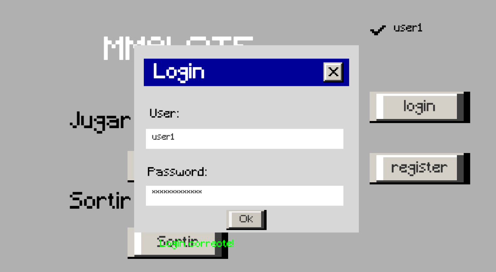
  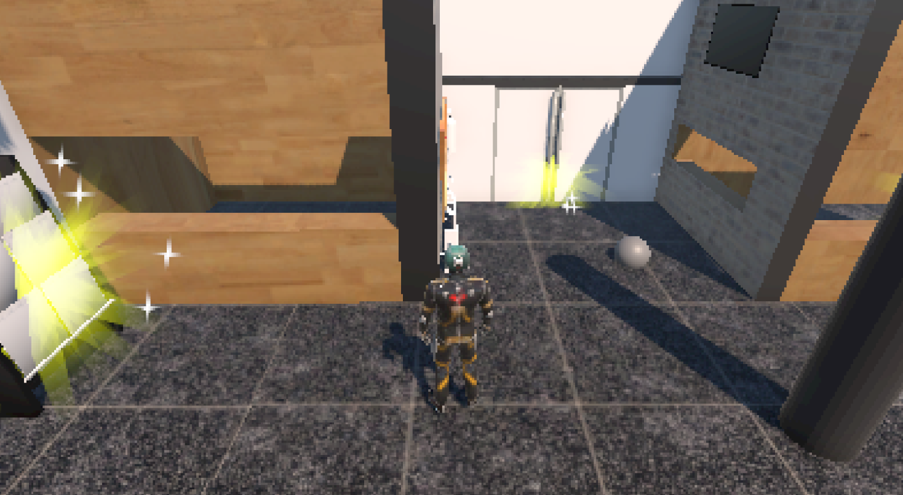
  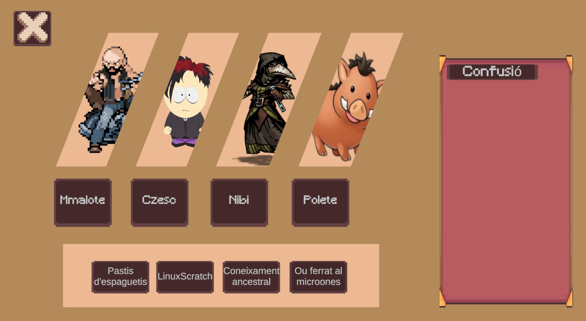
  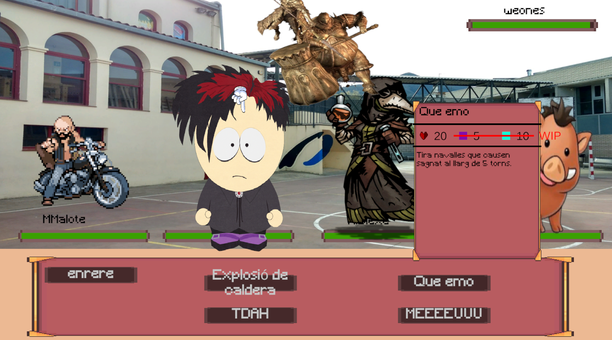

---

## 🧩 Característiques

- 🔥 Combat per torns  
- 🧙‍♂️ Sistema gestor d’habilitats    
- 🌐 Integració amb API pròpia  
- 💾 Sistema de login i dades de jugador  

---

## 🛠️ Tecnologies utilitzades

- **Unity 6**
- **C#**
- **API REST (Node/Express / ASP.NET / el que facis servir)**
- **GitHub Pages**
- **Itch.io**

---

## 📦 Estructura del projecte

<h3>Login </h3> 

  <h3>Login</h3>
  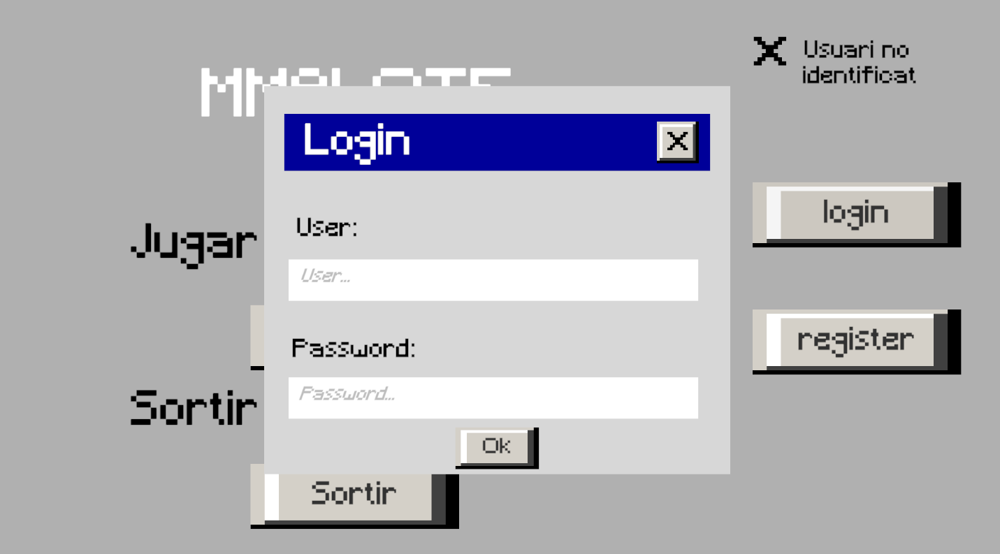

  <h3>Register</h3>
  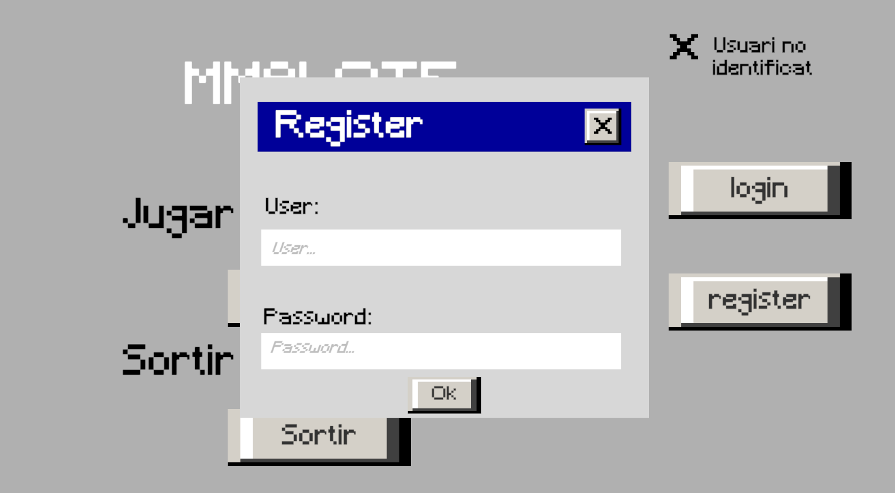

 
 

  
El joc conta amb un sistema de gestor d'usuaris. De manera que cada usuari pot equipar les seves habilitats propies. 

    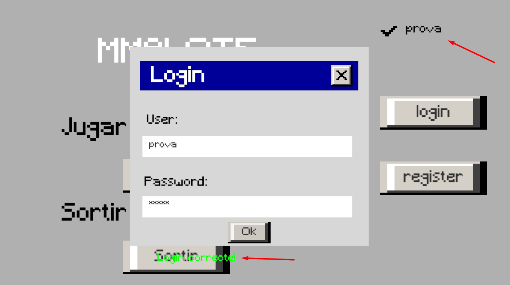
  

    Un cop ja has iniciat sessió amb un usuari correcte, l'usuari s'asigna automaticament al gestor d'usuari actiu i et permet entrar al joc
  

  
<h3>Open world</h3>

### · Objectes interactuables

    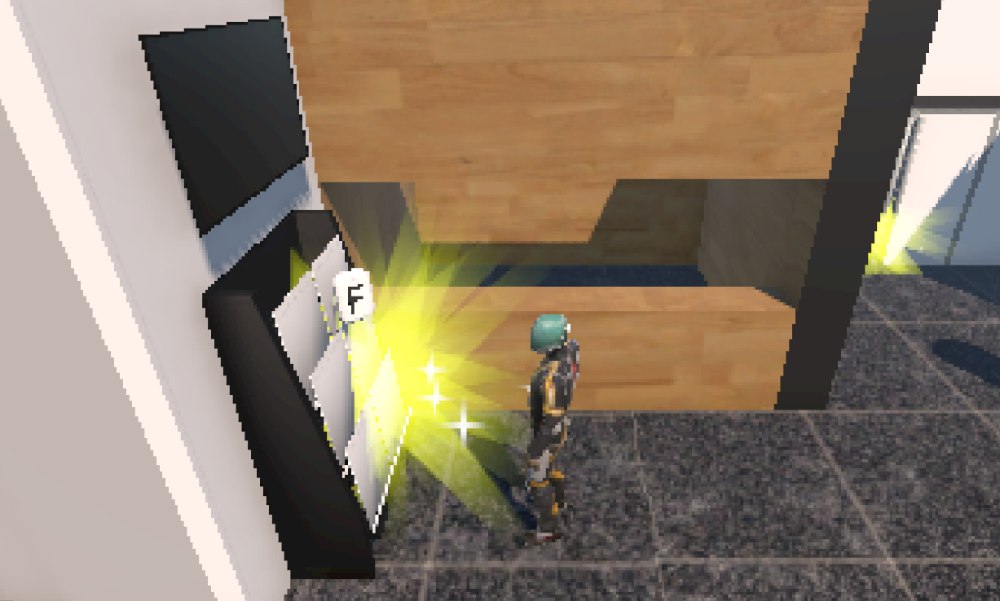
  

    En el món obert el jugador pot interactuar amb diferents objectes
  

### · Personatges interactuables

    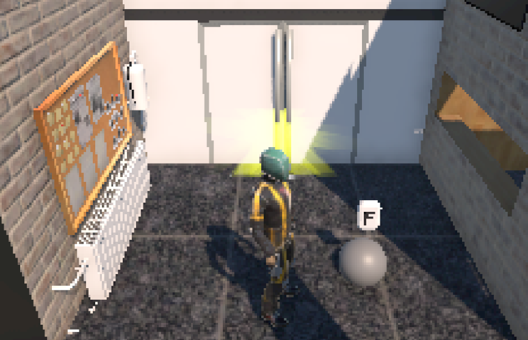
  
 En el món obert el jugador pot interactuar amb personatges.  

  
 Quan parles amb els personatges, et salten una serie de dialegs, pot ser que alguns personatges siguin enemics i entris en combat.

<h3>Gestor d'habilitats </h3> 

    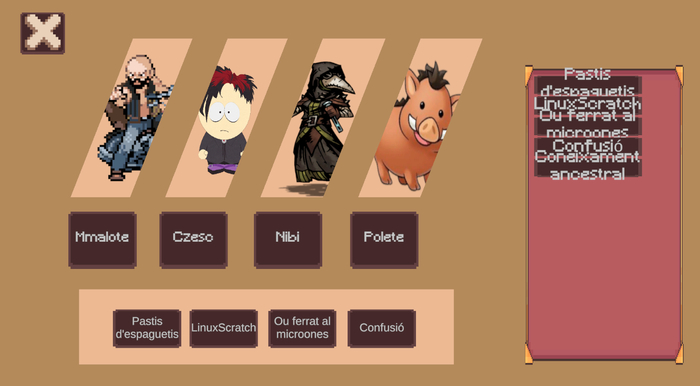
  
El gestor d'habilitats permet al jugador modificar les habilitats de tots el personatges.

  
Cada usuari té les sebes habilitats propies

    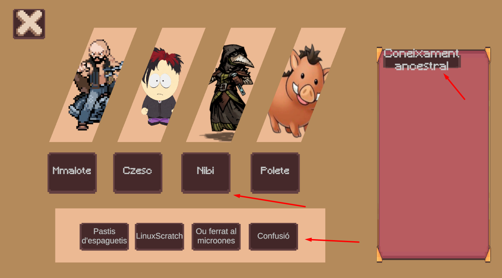
  
Per canviar les habilitats dels personatges primer s'ha de seleccionar el personatge

  
Després s'ha de clicar la habilitat en concret que vols canvir

  
Per últim s'ha de seleccionar per a quina habilitat vols canviar-la

