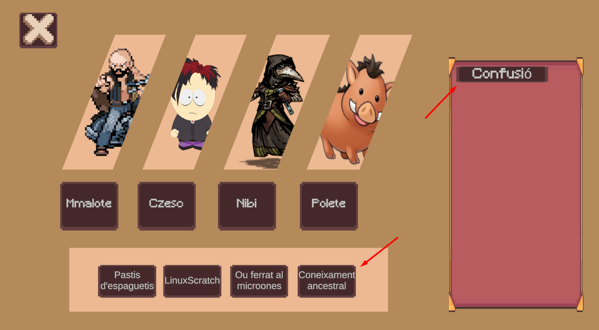
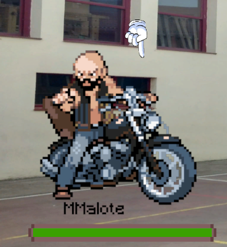
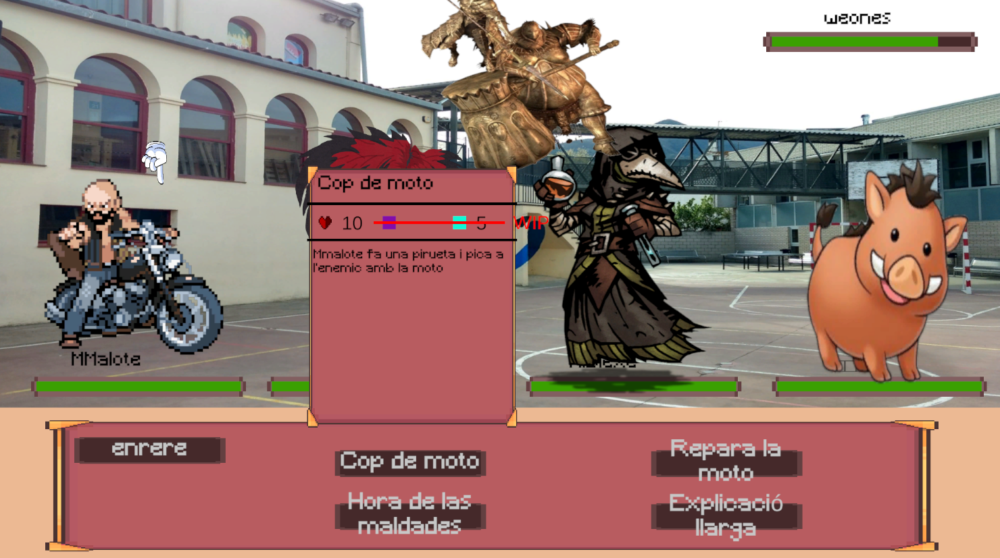

# 🎮 Mmalote — Unity Web Game

  
  
  
  

**Mmalote** és una experiència RPG interactiva desenvolupada amb **Unity 6**. El joc combina l'exploració de món obert amb un sistema de combat estratègic per torns, tot integrat amb una API pròpia per a la gestió d'usuaris i dades en temps real.

---

## 🚀 Juga Ara

Pots provar el joc directament al navegador a través de les següents plataformes:

| Plataforma | Enllaç Directe |
| :--- | :--- |
| **GitHub Pages** | [🕹️ Juga a la versió WebGL](https://pguardia-dam.github.io/MmaloteWEB/game/index.html) |
| **Itch.io** | [🎮 Visita la pàgina a Itch.io](https://sirmono25.itch.io/mmalote) |

---

## ✨ Característiques Principals

* ⚔️ **Combat per Torns:**
* 🧙‍♂️ **Gestor d'Habilitats:**
* 🌍 **Món Obert:**
* 🔐 **Sistema de Login:**
* 💾 **Persistència:**

---

## 📸 Captures de Pantalla

<table border="0">
 <tr>
    <td></td>
    <td></td>
 </tr>
 <tr>
    <td></td>
    <td></td>
 </tr>
</table>

---

## 🛠️ Tecnologies Utilitzades

* **Motor:** Unity 6 (LTS)
* **Llenguatge:** C# (.NET)
* **Backend:** API REST (Node.js / ASP.NET)
* **Hosting:** GitHub Pages & Itch.io

---

## 📦 Detalls del Projecte

### 🔐 Autenticació i Usuaris
El joc compta amb un flux complet de registre i inici de sessió que permet carregar les dades personals de cada jugador des de la base de dades.

  
  
   
  <em>Interfícies de login i registre connectades a l'API.</em>

### 🗺️ Exploració (Open World)
* **Objectes:** Interacció amb elements de l'entorn.
* **NPCs:** Sistema de diàlegs que poden activar esdeveniments o combats.

  
  

### ⚡ Gestor d'Habilitats
El jugador pot modificar les habilitats dels personatges seguint aquests passos:
1.  **Seleccionar** el personatge.
2.  **Triar** l'habilitat a substituir.
3.  **Equipar** la nova habilitat disponible per a l'usuari.

  
  
  

### ⚔️ Combat per Torns
L'ordre de combat està definit per la posició dels aliats (1 al 4), seguit de l'atac aleatori de l'enemic. Inclou **tooltips** informatius sobre cada habilitat.

  
  

---

* **P. Guardia** - [Perfil de GitHub](https://github.com/pguardia-dam)
